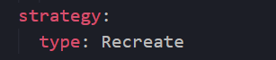

# Reflection 1
1.  Compare the application logs before and after you exposed it as a Service. Try to open the app several times while the proxy into the Service is running. What do you see in the logs? Does the number of logs increase each time you open the app?
- Sebelum aplikasi diekspos sebagai service, log aplikasi hanya menampilkan pesan yang menunjukkan bahwa server HTTP telah dimulai dan mendengarkan di port 8080, server UDP telah dimulai dan mendengarkan di port 8081. Setelah aplikasi diekspos sebagai service, kita dapat berinteraksi dan berkomunikasi dengan server dari luar klaster Kubernetes. Ketika Anda membuka aplikasi beberapa kali dengan proxy ke layanan yang berjalan, log akan bertambah besar. Ini karena server memiliki fungsi logging yang mencatat setiap permintaan HTTP yang masuk beserta stempel waktunya. Setiap kali aplikasi dibuka, permintaan HTTP dikirim ke server, memicu log untuk mencatat pesan tambahan.

2. Notice that there are two versions of `kubectl get` invocation during this tutorial section. The first does not have any option, while the latter has `-n` option with value set to `kube-system`. What is the purpose of the `-n` option and why did the output not list the pods/services that you
explicitly created?
- Selama bagian tutorial ini, terdapat dua versi perintah kubectl get. Yang pertama digunakan tanpa opsi apa pun, sedangkan yang kedua menggunakan opsi -n dengan nilai yang disetel ke kube-system. Flag -n berarti namespace, jadi perintah kubectl get pods,services -n kube-system mengambil semua pod dan layanan dalam namespace 'kube-system'. Layanan dan pod sebelumnya berada di namespace yang berbeda ('default'), itulah sebabnya layanan/pod yang telah dibuat sebelumnya tidak muncul di output.

# Reflection 2
1. What is the difference between Rolling Update and Recreate deployment strategy?
Rolling Update is a deployment strategy that updates the pods in a rolling fashion, meaning that it updates the pods one by one, while the old pods are still running. This is done to ensure that the application is still running while the update is being done. Recreate deployment strategy on the other hand, deletes all the old pods and creates new pods with the updated version. This means that the application will be down for a short period of time while the update is being done.

2. Try deploying the Spring Petclinic REST using Recreate deployment strategy and document your attempt.

- Mulai dengan mengubah strategi dalam file deployment.yaml menjadi recreate, kemudian terapkan file deployment.yaml tersebut.

- Kemudian hapus metadata yang dihasilkan secara otomatis seperti creationTimestamp (dan resourceVersion, selfLink, dan uid), yang tidak seharusnya ada dalam file konfigurasi deklaratif.

- Untuk melihat deployment action, ubah versi aplikasi dalam file deployment.yaml dari 3.2.1 menjadi 3.2.0.

- Kemudian terapkan perubahan tersebut menggunakan perintah `kubectl apply -f deployment.yaml`. Pod-pod yang ada akan dihapus dan pod-pod baru akan dibuat dengan versi terbaru dari aplikasi. Seperti yang kita lihat, strategi recreate menghapus semua pod-pod lama (replica set lama menjadi 0) dan membuat 4 pod baru dengan versi terbaru dari aplikasi.

3.Menyiapkan berbagai file manifest untuk menjalankan strategi deployment recreate. File manifest untuk strategi deployment recreate dapat ditemukan di dalam file `recreate.yaml` di repositori tersebut.

4. What do you think are the benefits of using Kubernetes manifest files? Recall your experience in deploying the app manually and compare it to your experience when deploying the same app by applying the manifest files (i.e., invoking `kubectl apply -f` command) to the cluster.
- Dengan file manifest Kubernetes, kita dapat mendefinisikan keadaan yang diinginkan dari aplikasi secara deklaratif dan secara programatis. Ini berarti kita dapat menentukan keadaan aplikasi yang kita inginkan, dan Kubernetes akan memastikan bahwa keadaan aktual dari aplikasi sesuai dengan keadaan yang diinginkan. Ini sangat berguna karena kita dapat dengan mudah melakukan deployment, pembaruan, dan penghapusan aplikasi di sebuah klaster Kubernetes hanya dengan menerapkan file manifest. Hal ini jauh lebih mudah dan cepat dibandingkan dengan melakukan deployment aplikasi secara manual, karena kita tidak perlu secara manual membuat pod, layanan, dan deployment, serta tidak perlu secara manual memperbarui aplikasi. Kita hanya perlu mendefinisikan keadaan yang diinginkan dari aplikasi dalam file manifest, dan Kubernetes akan menangani sisanya. Ini juga memungkinkan untuk reproduktibilitas, karena kita dapat dengan mudah membuat ulang aplikasi di klaster lain dengan hanya menerapkan file manifest.